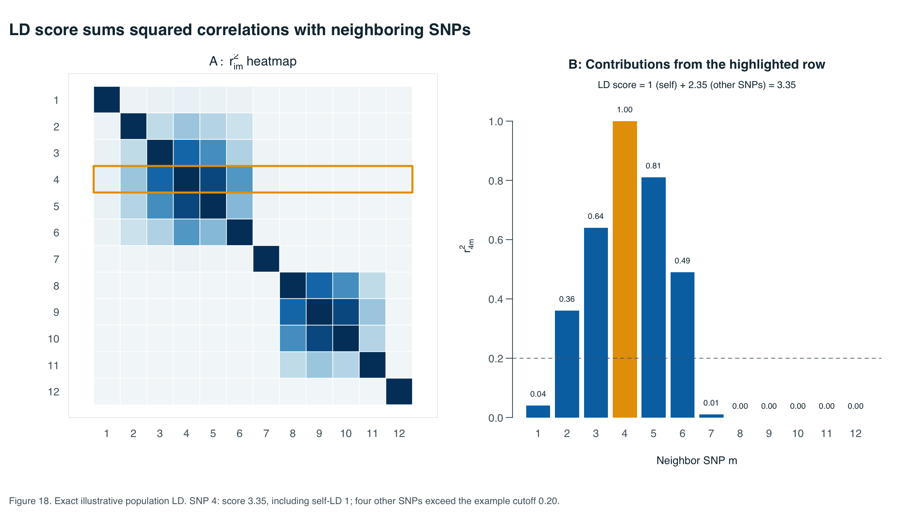

# ATIG 2026 — reproducible teaching code

Simulation and figure-generation code for the population-structure lecture.
Version **0.1.0** contains the examples developed for the September 2026 slides.
It produces **23 numbered figure families** in PNG, PDF and SVG, together with
their calculated data and numerical checks.

The genotype and phenotype examples are synthetic. The two published numerical
summaries are explicitly labelled and cited. Lecture files, participant data,
downloaded paper panels and private course documents are not stored here.

## Reproduce the figures

Install R and the packages `bigsnpr`, `bigstatsr` and `jsonlite`. On macOS, install
Poppler (`pdftocairo`) for SVG conversion; for example, `brew install poppler`.
The other platforms use R's Cairo graphics devices. A working Cairo-capable R
installation is required there.

From this repository's root:

```sh
Rscript scripts/install_dependencies.R   # once, if the packages are missing
Rscript scripts/reproduce.R
```

The second command runs all calculations, writes the figures to
`outputs/figures/`, checks numerical invariants, and records package versions
and elapsed times in `outputs/run_manifest.json`. It needs no network access.
An optional output directory can be supplied:

```sh
Rscript scripts/reproduce.R outputs_classroom
```

For the spacious LD heatmap with actual LaTeX equations, use the
[optional LaTeX workflow](population_structure/optional/ld_score_latex/README.md).
The normal R workflow already reproduces its data and scientific content.

## What is here

| Location | Contents |
|---|---|
| `population_structure/R/` | Simulations, deterministic worked examples and portable scientific plots. |
| `population_structure/data/` | Two small, source-cited published summary tables; no individual data. |
| `population_structure/figures/` | Rendered PNG examples from the validated release. |
| `population_structure/prompts/` | The three saved prompts for the generated admixture/stratification illustrations. |
| `scripts/` | One-command reproduction, dependency installation and numerical validation. |
| `provenance/` | Lecture baselines, original-source hashes and historical layout sources. |
| [Methods](docs/METHODS.md) | Notation, generating models, seeds, assumptions and interpretation. |
| [Figure inventory](docs/FIGURES.md) | Stable figure IDs, their data sources and links to published panels. |
| [Validation](docs/VALIDATION.md) | What was reproduced and checked for this version. |

**Table 1.** Repository contents. Figure IDs are stable within the code repository;
they are independent of slide and equation numbers in an editable lecture.



**Figure 18.** Exact illustrative population LD. The highlighted row has score
3.35, including self-correlation 1. Four other SNPs exceed an illustrative
`r² ≥ 0.20` cutoff. That cutoff is not used to calculate the LD score.

## Reuse and limitations

The code is teaching material, not a production GWAS pipeline. A single selected
simulation does not establish general calibration, power or robustness. The
LDSC examples simulate a working model for test statistics rather than real
genotype GWAS data. See the methods for the distinction.

No open-source license has been chosen for this private repository. Existing
third-party software and published material remain under their own licenses.
